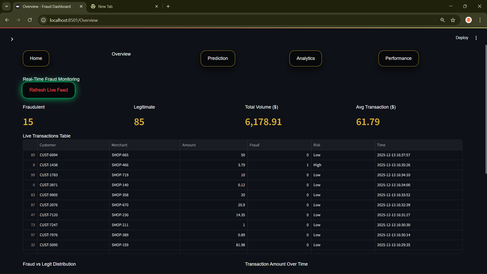
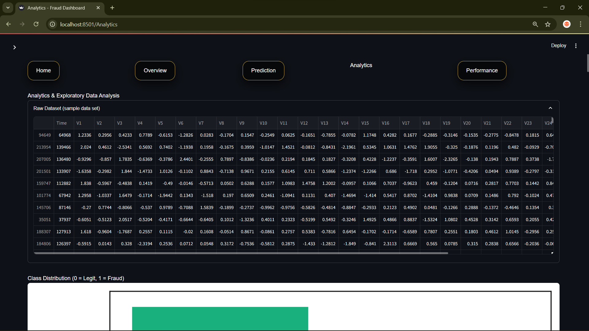
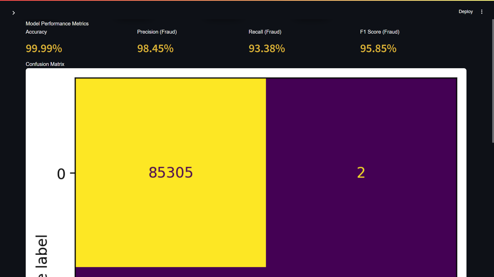

<!-- PROJECT HEADER -->

  

<h1 align="center">💳 Fraud Detection System — Real-Time ML Dashboard</h1>

  An end-to-end Credit Card Fraud Detection system combining Machine Learning, simulation, and interactive analytics through a Streamlit dashboard.

---

## 📊 **Project Overview**
Financial fraud is rare — but extremely costly.

This project simulates how **real-world banking systems** detect fraudulent credit card transactions using **machine learning models** and transform raw transaction data into **actionable insights** through a professional dashboard.

The system focuses on:
- 🔍 Detecting fraudulent transactions
- 📈 Understanding fraud patterns through EDA
- ⚖ Evaluating model performance on imbalanced data
- 🧠 Making ML decisions explainable and visual

---

## 🎯 **Project Objectives**
✔ Build a machine-learning based fraud classification model  
✔ Handle highly imbalanced transaction data  
✔ Visualize fraud vs legitimate behavior clearly  
✔ Simulate real-time transaction monitoring  
✔ Evaluate model reliability using proper metrics  

---

## 🧠 **Machine Learning Model**
- **Algorithm**: Logistic Regression  
- **Dataset**: Kaggle Credit Card Fraud Dataset  
- **Features**:
  - PCA-transformed features (`V1–V28`)
  - Transaction `Time`
  - Transaction `Amount`
- **Target Variable**:
  - `0` → Legitimate transaction  
  - `1` → Fraudulent transaction  

### 📊 **Evaluation Metrics**
- Accuracy  
- Precision  
- Recall  
- F1 Score  
- Confusion Matrix  

> ⚠ Accuracy alone is misleading in fraud detection due to class imbalance.  
> Precision and Recall are emphasized to minimize financial loss.

---

## 📈 **Dashboard Features**

### 🏠 **Landing Page**
- Cinematic video background
- Clean navigation to all modules
- Professional first impression

### 🔍 **Overview**
- Simulated real-time transactions
- Fraud vs Legitimate metrics
- Transaction trends and distributions
- Live data table

### 🧪 **Prediction**
- Manual transaction feature input
- Fraud prediction with probability score
- Simulates real banking decision engines

### 📊 **Analytics (EDA)**
- Class distribution (imbalance visualization)
- Transaction amount distribution
- Time vs Amount scatter analysis
- Correlation heatmap
- Violin plots for top correlated features
- Raw dataset exploration

### 📉 **Model Performance**
- Accuracy, Precision, Recall, F1 Score (in %)
- Confusion Matrix visualization
- Model reliability assessment

---

## 🛠 **Tech Stack**
| Tool / Library | Purpose |
|----------------|--------|
| **Python** | Core programming |
| **Streamlit** | Interactive dashboard |
| **Scikit-learn** | Machine learning |
| **Pandas & NumPy** | Data processing |
| **Seaborn & Matplotlib** | Statistical visualization |
| **Plotly** | Interactive charts |
| **VS Code** | Development environment |
| **GitHub** | Version control & documentation |

---

## 📦 **Dataset**
| Dataset | Description |
|--------|-------------|
| Credit Card Fraud Dataset | Real-world anonymized transactions |

- 284,807 transactions  
- 492 fraud cases  
- Highly imbalanced dataset  

> PCA-transformed features ensure privacy while preserving fraud patterns.

---

## 🌍 **Real-World Applications**
- Banking & Financial Institutions  
- Payment Gateways  
- E-commerce Platforms  
- Fraud Monitoring Systems  

---

## 🔮 **Future Enhancements**
- Real-time API integration
- Alert & notification system
- Advanced ML / Deep Learning models
- Merchant network fraud graph
- Cloud deployment

---

## 🧠 **What I Learned**
- Handling imbalanced datasets in ML
- Importance of precision & recall over accuracy
- Translating ML outputs into business insights
- Designing clean, intuitive analytical dashboards
- Storytelling through data visualization

---

## 📸 **Dashboard Screenshots**

| Landing | Overview |
|--------|----------|
|  |  |

| Analytics | Performance |
|----------|-------------|
|  |  |

---

## ▶️ **Demo Video**
📽 *Add your dashboard working video link here*

---

## 👤 **Author**
**Rajsv Mahendra**  
Student | Data Science & Machine Learning Enthusiast  

🔗 **LinkedIn**: https://www.linkedin.com/in/rajsv-mahendra  
📦 **GitHub**: https://github.com/rajsvmahendra  

---

## ⭐ **Support**
If you found this project useful or insightful, consider ⭐ starring the repository — it helps reach more learners and practitioners!
