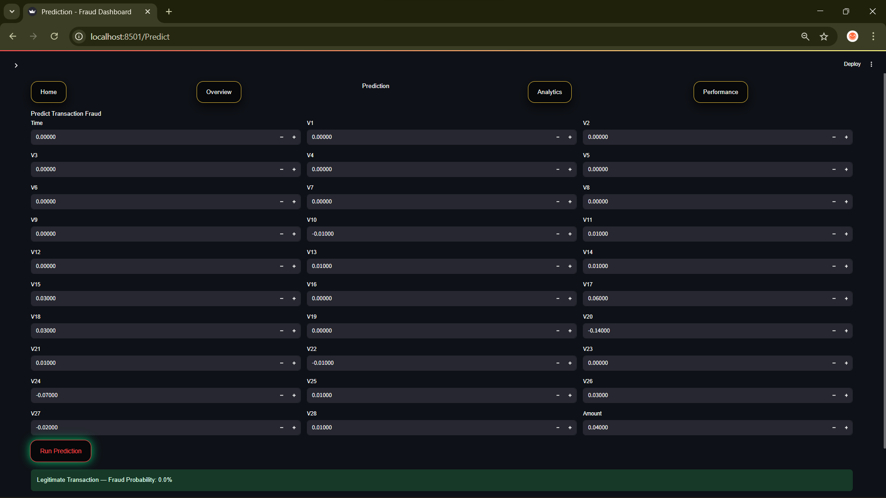

<!-- PROJECT HEADER -->

  

<h1 align="center">💳 Fraud Detection System — Real-Time ML Dashboard</h1>

  An end-to-end Credit Card Fraud Detection system combining Machine Learning, simulation, and interactive analytics using Streamlit.

---

## 📊 Project Overview
Financial fraud is rare — but extremely costly.

This project simulates how real-world financial systems detect fraudulent credit card transactions using machine learning models and transform raw transaction data into actionable insights through an interactive dashboard.

The system focuses on:
- Detecting fraudulent transactions
- Understanding fraud patterns through EDA
- Evaluating model performance on imbalanced data
- Making ML decisions explainable and visual

---

## 🎯 Project Objectives
✔ Build a machine-learning based fraud classification system  
✔ Handle highly imbalanced transaction data  
✔ Visualize fraud vs legitimate behavior  
✔ Simulate real-time transaction monitoring  
✔ Evaluate model reliability using proper metrics  

---

## 🧠 Machine Learning Model
- **Algorithm**: Logistic Regression  
- **Dataset**: Kaggle Credit Card Fraud Dataset  
- **Features**:
  - PCA-transformed features (V1–V28)
  - Transaction Time
  - Transaction Amount
- **Target Variable**:
  - 0 → Legitimate  
  - 1 → Fraudulent  

### 📊 Evaluation Metrics
- Accuracy  
- Precision  
- Recall  
- F1 Score  
- Confusion Matrix  

> Accuracy alone is misleading in fraud detection due to class imbalance.  
> Precision and Recall are prioritized to minimize financial loss.

---

## 📈 Dashboard Features

### 🏠 Landing Page
- Cinematic video background
- Clean navigation to all modules

### 🔍 Overview
- Simulated real-time transactions
- Fraud vs Legitimate metrics
- Transaction trends and live table

### 🧪 Prediction
- Manual feature input
- Fraud prediction with probability score

### 📊 Analytics (EDA)
- Class distribution
- Transaction amount distribution
- Time vs Amount analysis
- Correlation heatmap
- Violin plots for top features
- Raw data exploration

### 📉 Model Performance
- Accuracy, Precision, Recall, F1 Score (in %)
- Confusion Matrix visualization

---

## 🛠 Tech Stack
- Python  
- Streamlit  
- Scikit-learn  
- Pandas & NumPy  
- Seaborn & Matplotlib  
- Plotly  
- VS Code  

---

## 📦 Dataset
- Kaggle Credit Card Fraud Dataset  
- 284,807 transactions  
- 492 fraud cases  
- Highly imbalanced data  

---

## 🌍 Real-World Applications
- Banking & Financial Institutions  
- Payment Gateways  
- E-commerce Platforms  
- Fraud Monitoring Systems  

---

## 📸 Dashboard Screenshots

| Overview | Analytics |
|---------|-----------|
|  |  |

| Prediction | Performance |
|-----------|-------------|
|  |  |

---

## ▶️ Demo Video
🎥 See full dashboard walkthrough in the demo video:
`assets/frauddetextionDashboard.mp4`

---

## 👤 Author
**Rajsv Mahendra**  
Student | Data Science & Machine Learning Enthusiast  

🔗 LinkedIn: https://www.linkedin.com/in/rajsv-mahendra  
📦 GitHub: https://github.com/rajsvmahendra  

---

## ⭐ Support
If you found this project useful, consider starring ⭐ the repository.
